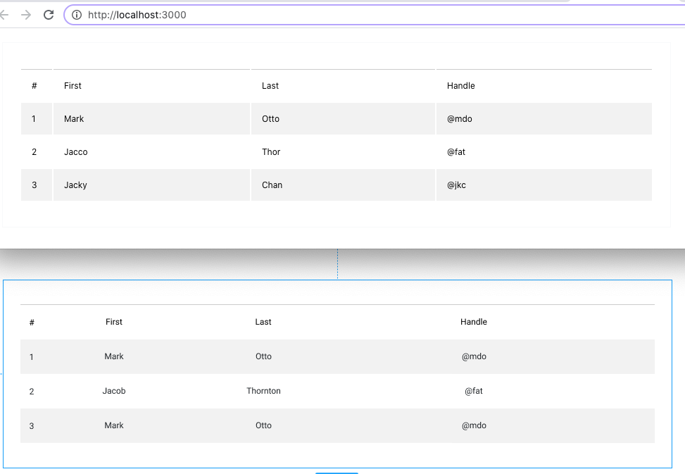

## BÀI 1 
1) Remix: https://glitch.com/~codersx-react-template
2) Mở design: https://www.figma.com/file/M2Lh7XaEKWnds9SeEuJ1l0/B%C3%A0i-t%E1%BA%ADp-CSS-cho-entry-test?node-id=176%3A31
3) Sử dụng kiến thức đã học thêm class is-even cho các hàng chẵn <tr>
4) Style CSS sao cho ra kết quả như design

**Results:**
